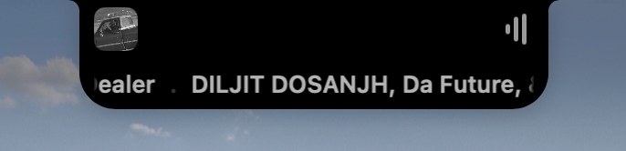
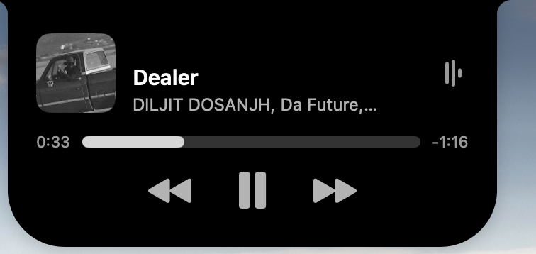

# Notchly

iOS-style Dynamic Island for MacBooks with a hardware notch. Native SwiftUI, runs as a menu-bar app, no internet, no telemetry.



## Features

- **Now playing** — media artwork, title, artist, scrubber, transport controls. Hovers expand to a full panel; idle compact pill returns automatically.
- **Title banner** — track changes briefly slide a marquee title across the notch.
- **System HUD** — volume and brightness keys are intercepted; the notch becomes the HUD instead of macOS's default OSD.
- **Bluetooth connect banner** — when an audio device (AirPods, Beats, headphones, speakers) connects, the notch shows the device's icon and current battery in a 3-second banner.
- **Menu-bar toggle** — enable/disable Notchly from the menu bar without quitting the app.

| Idle | Compact (now playing) | Title banner | Expanded |
|------|------|------|------|
|  |  |  |  |

## Requirements

- MacBook with hardware notch (M1 Pro/Max 14"/16", M2/M3/M4 Pro/Max). The app exits with an alert if no notch is detected.
- macOS 14 (Sonoma) or newer.
- Xcode 16+ to build.

## Install (pre-built zip)

1. Unzip `Notchly-YYYY-MM-DD.zip` to `/Applications`.
2. First launch: right-click `Notchly.app` → **Open** to bypass Gatekeeper (binary is ad-hoc signed only).
3. Grant Bluetooth permission on first AirPods connect.
4. Optional: grant Accessibility (System Settings → Privacy & Security → Accessibility) so the system HUD can intercept volume/brightness keys.

## Build from source

```bash
git clone <repo-url> notchly
cd notchly
xcodebuild \
  -project "Dynamic island.xcodeproj" \
  -scheme "Dynamic island" \
  -configuration Release \
  build
```

The Xcode target name is still "Dynamic island" internally for historical reasons; the produced bundle is `Notchly.app` with bundle ID `Prateek.Notchly`.

Open in Xcode for live preview / debugging.

## Usage

- **Hover** the notch to expand the now-playing panel.
- **Volume / brightness keys** are routed through the notch HUD when Notchly has Accessibility permission. Without it, the system OSD shows as usual.
- **Bluetooth connect**: any audio device that newly connects triggers a 3 s banner with icon + battery ring (green; yellow at ≤40%; red at ≤20%). For AirPods, the percentage shown is the lower of the two pods (case battery is fallback only).
- **Menu bar**: click the rectangle glyph next to the clock → toggle Enable/Disable, Quit.

## Permissions

| Capability | Why | How to grant |
|---|---|---|
| Bluetooth | Detect connect events + read battery | Prompted on first connect; or System Settings → Privacy & Security → Bluetooth |
| Accessibility | Intercept volume/brightness keys for the HUD | System Settings → Privacy & Security → Accessibility (toggle on) |

No network access is required or used.

## Architecture

```
Dynamic island/                 macOS app target (compiled into Notchly.app)
├── App/
│   ├── AppDelegate.swift       wires services + window
│   └── MenuBarController.swift NSStatusItem + enable/disable
├── Notch/                      panel, window, hover, shape
├── Phases/                     idle / compact / title-banner / expanded / HUD views
├── Media/                      MediaRemoteAdapter bridge
├── System/
│   └── SystemHUDService.swift  volume + brightness HUD via CGEventTap
└── Bluetooth/
    ├── BluetoothMonitorService.swift   IOBluetooth notifications
    ├── IORegistryBatteryReader.swift   fast-path battery (IOKit)
    └── SystemProfilerBatteryReader.swift  fallback battery (system_profiler)

DynamicIslandCore/              SPM package — pure Swift, no AppKit/IOBluetooth
├── Phase, PhaseReducer         finite-state model
├── NowPlayingService           snapshot pipeline from MediaRemote
├── TransportController         play/pause/skip
├── BluetoothBanner             payload + battery model
├── IconResolver                product-ID + name-based icon mapping
└── BatteryReaderProtocol       Sendable composable reader
```

State flow:

1. `PhaseReducer` derives the current phase from `(hover, hasMedia, recentChange)`.
2. `NotchView` reads the phase + the latest `SystemHUDState` and selects which sub-view to render. HUD events (volume/brightness/bluetooth) overlay any phase.
3. `BluetoothMonitorService` listens for `IOBluetoothDevice` connect callbacks → resolves icon + battery → calls `SystemHUDService.showBluetoothBanner(...)` which surfaces in the same HUD slot.

## Tests

Unit tests live in `DynamicIslandCore/Tests/`:

```bash
cd DynamicIslandCore
swift test
```

Coverage:
- `PhaseReducer` decision matrix
- `NowPlayingService` snapshot + recent-change windowing
- `TransportController` command shaping
- `BatteryReading.displayLevel` (lowest bud, case fallback)
- `IconResolver` (Apple PID table + name fallback + CoD class decoding)
- `CompositeBatteryReader` (fast-path / fallback orchestration)

## Design + Plan Docs

- Spec: `docs/superpowers/specs/`
- Plan: `docs/superpowers/plans/`

These were generated during brainstorming and execution; useful as design history when extending the app.

## Known limitations

- Multi-display: the panel attaches to the primary screen with a notch. Hot-plugging an external display while running may require relaunch.
- Bluetooth: only audio-class devices trigger the connect banner. Mice/keyboards/watches are intentionally filtered.
- Disconnect events do not show a banner (intentional — keeps the surface quiet).
- macOS's built-in AirPods connect popup is *not* suppressed (no clean public API).

## License

Personal project. No formal license set yet.
